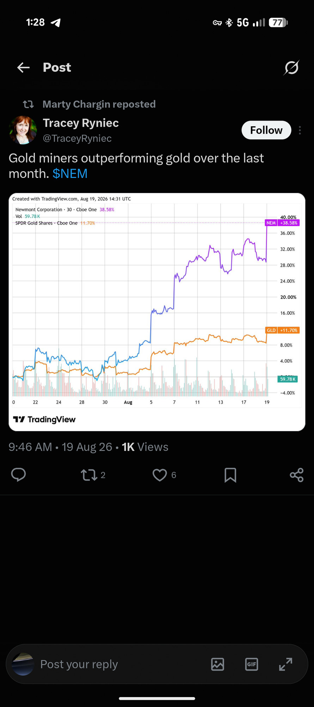

# Market Strength Map — holistic multi-asset leadership (design SoT)

**Status:** design-in-progress (#494). Slice 1 (crypto-vs-market pulse, #493) shipped 2026-07-20.
**Origin:** operator 2026-07-20 — *"Do we have a holistic view of where strength is? It can be crypto,
healthcare, gold/silver, whatever it is."* This doc is the durable context for the goal so the design
survives across sessions.

## The goal

One holistic, at-a-glance view of **where strength is across the whole market** — an extension of the
RS/theme work, not a crypto-only feature. Answer, in one glance: *which asset classes / sectors /
themes are leading right now, and what is rotating up vs down?* The trigger question was "is BTC/ETH
holding up while equities correct?" — but that is one instance of the general question.

## What we already have (inventory, 2026-07-20)

- **Equity strength — substantial.** The ADR-0032 **ecosystem board** rolls ~9,700 stocks → themes →
  20 ecosystems ranked by breadth-weighted RS (E-CYBR, E-INS, E-CONS…). Plus **ROTATION WATCH**
  (`get_rs_turners` — sectors turning weak→strong), **RISING** (`get_rs_velocity` — sustained accel),
  **RECOVERY** (`get_rs_recovery`, #492 — fast V-turn off a weak base), and **RS leaders**. Metals/energy
  already appear here *as their miner/ETF equities* (the "Precious Metals Miners" theme, Energy names).
- **Crypto — data exists, mostly dark.** Nightly crypto RS module (`crypto/`): top-250-by-mcap ∪
  27-name watchlist, `crypto_rs_scores` (rs_1m/3m/6m/composite, mcap-bucketed), BTC dominance. Gated by
  `CRYPTO_RS_ENABLED` (off) → `/crypto`, `/altseason` hidden.
- **Regime** — market condition + Stockbee breadth (MAs, VIX, T2108), QQQ-centric. No crypto/commodities.

## The gaps (why it doesn't feel holistic yet)

1. **Equity-only frame.** Crypto is a separate silo on its *own* RS scale; metals/oil exist only as
   equities, not as assets.
2. **Fragmented.** Ecosystem scorecard, rotation watch, RS leaders, crypto — four surfaces, no single map.
3. **No cross-asset ranking.** Equity-RS and crypto-RS percentiles aren't comparable, so nothing says
   *"crypto is THE leading asset class right now, vs stocks vs metals."*

## The model (working draft)

A **two-layer map**:

- **Top layer — asset-class leadership.** Equities · Crypto · Metals · Energy · Bonds, each ranked by
  trailing RS vs a common benchmark → *"where's the money going?"* one glance. Slice 1 (crypto-vs-market
  pulse) is the first cell (Crypto vs Equities); add Metals, Energy rows the same way.
- **Middle layer — within the leading class.** For equities: the ecosystem board (have it). For crypto:
  tiered token RS (#492-B). Drill from the strong asset class into what inside it is strong.
- **Rotation woven through both** — "what's turning up/down" at each layer (ROTATION WATCH generalizes).

Surface = evening brief and/or `/hud`. **No new commands** (operator constraint 2026-07-20).

## ✅ RESOLVED 2026-08-08 — asset ↔ equity mixing: GROUP THEM (the hybrid complex)

The asset-vs-equity split is **not clean**. A precious-metals move shows up in *both* gold/silver
(the asset) *and* the miners (equities) — and we want to see strength in both, plus their relationship.
Same for crypto ↔ crypto miners/MSTR/COIN, energy/commodities ↔ energy equities, and on down the list.
An equity expression is a **leveraged, higher-beta play on the underlying asset plus idiosyncratic
equity risk** — miners can lead, confirm, or lag the metal, and that divergence is itself signal.

**OPERATOR RULED 2026-08-08: option 3, the COMPLEX.** The two rejected options are kept below with the reason each lost, so neither is re-proposed later.

**The options as they were weighed:**

1. **Separate** — asset-class RS (gold, crypto, oil) as one layer; equity RS (ecosystem board) as
   another. Simple; loses the link.
2. **Unified** — assets *and* their equity expressions on one common RS/return frame. Shows gold next
   to gold-miners; but conflates different vol/risk profiles on one percentile scale.
3. **Hybrid "complex"** (leading candidate) — a **complex** groups an asset with its equity expression:
   *Precious Metals complex* = {gold, silver, GDX/miner theme}; *Crypto complex* = {BTC/ETH, MSTR/COIN,
   crypto miners}; *Energy complex* = {oil/gas, XLE/E&P}. The map shows the **asset as anchor + the
   equities as the leveraged expression + their divergence** (are miners confirming/leading/lagging the
   metal?). Richest; directly answers "we see gold *and* gold stocks rise — show me both + the relationship."

Open sub-questions for #494: common cross-asset RS frame (trailing-return percentile? vol-adjusted?);
where commodity/asset price series come from (we have crypto closes + equity/ETF closes; spot metals/oil?);
how a "complex" maps onto the existing theme/ecosystem structure; how rotation reads across asset classes.

## ⚠ DATA AVAILABILITY — answered 2026-08-07, BEFORE the design session (it changes the fork)

The doc listed *"where do commodity/asset price series come from (spot metals/oil?)"* as an open
sub-question. **It is answered, and the answer removes a constraint rather than adding one:**

**Every asset class we would want already has a liquid ETF proxy carried in `mi_daily_closes`, with
279 daily bars (2025-06-30 → today, ~13 months) — no new data source, no new ingest, no spot feed.**

| Complex | Asset anchor (have) | Equity expression (have) |
|---|---|---|
| Precious metals | GLD · IAU · SLV · PPLT | GDX · GDXJ · SIL |
| Crypto | 289 tokens in `crypto_daily_closes` (BTC/ETH/SOL scored) | MSTR · COIN · miners (equity RS) |
| Energy | USO · UNG | XLE · XOP |
| Industrial metals | CPER · DBC | COPX · XME |
| Uranium | — | URA |
| Agriculture | WEAT · CORN | — |
| Macro backdrop | TLT (rates) · UUP (dollar) | — |

**Why this matters to the decision:** 279 bars comfortably clears the composite RS window
(40% × 1M + 30% × 3M + 30% × 6M needs ~126 bars), so **option 3 (hybrid complex) is buildable TODAY
on data we already ingest.** The fork is therefore a genuine design choice, not a
choose-what-we-can-afford — which is what it would have been had the answer come back "we have no
metals prices."

**Two caveats to carry into the session, not blockers:**
- 13 months of history means a 6-month RS window has ~7 months of lookback for percentile context.
  Fine for ranking, thin for regime comparison across a full cycle.
- `crypto_daily_closes` has at least one row stamped `1969-12-31` (epoch zero) — a bad row to clean
  before any cross-asset percentile is computed off min/max dates. Cosmetic, but it would silently
  skew a "since inception" frame.

**Deliberately NOT decided here:** which of the three mixing models to adopt, and what the common
cross-asset RS frame should be (raw trailing-return percentile vs vol-adjusted). Gold at 12%
annualised vol and a junior miner at 60% do not belong on one raw percentile scale without a
stated choice — that IS the operator's call and the reason this session exists.

## Findings / evidence (2026-07-20)

- **Crypto IS leading the correction** (trailing return): 4wk BTC +2.0 / ETH +10.1 / SOL +8.0 vs
  QQQ −5.7 / SPY −0.3 / IWM −2.0 (2wk: BTC +1.9 / ETH +5.7 vs QQQ −3.7). ETH out-performing QQQ by ~16pts/4wk.
- Crypto-equity proxies recovering on the short window (rs_1m MSTR 76 / COIN 77 / BMNR 98) but buried in
  composite RS (22/28/40) — surfaced via the new RECOVERY section (#492).
- Crypto token universe is **sound, not "polluted"** (my earlier word was wrong): top-250-by-mcap +
  watchlist, $15M floor, majors scored (BTC/ETH/SOL comp ~58). Real issues = mcap-blind RS ranking
  (micro-caps dominate the leaderboard; `mcap_bucket`/`rs_in_bucket` exist but the default view ignores
  them) + young coins NULL composite (HYPE has 174 bars, ~1wk short of the 6-mo window). → #492-B.

## ⭐ THE RISK-SPECTRUM AXIS (operator 2026-08-08) — a complex has TWO spreads, not one

His words, kept verbatim because the framing is the contribution:

> *"maybe there's sub splits on market cap for example, works for crypto as well, if smaller caps
> rise faster which is expected in a bull market with more risk taking, ppl going further into
> riskier spectrum, this is info. In crypto world, this is called alt season."*

So a complex carries **two independent readings**, and conflating them loses the second:

1. **DIRECTION** — anchor vs its equity expression. *Are the miners outrunning the metal?*
2. **RISK APPETITE** — large-cap expression vs small-cap expression **inside the same complex**.
   *Are the juniors outrunning the seniors?* Small-caps leading = money moving further out the
   risk curve. **This is the same phenomenon crypto calls ALT SEASON**, and naming it that way
   makes it one concept across every asset class instead of a crypto curiosity.

**It generalises because the pairs already exist as ETFs:**

| complex | senior / large | junior / small | the risk read |
|---|---|---|---|
| Precious metals | **GDX** (senior miners) | **GDXJ** (junior miners) | juniors leading = risk-on in metals |
| Energy | **XLE** (integrated majors) | **XOP** (E&P, higher beta) | E&P leading = risk-on in energy |
| Crypto | BTC | alts (`crypto_rs_scores.mcap_bucket`, `crypto_btc_dominance`) | falling dominance = **alt season** |

⚠ **Only claim the split where it is REAL.** Uranium (URA alone), agriculture (WEAT/CORN) and the
macro row have no honest large-vs-small pair in what we hold — those complexes show DIRECTION
only. Inventing a spectrum from two ETFs that merely differ in composition (e.g. XME vs COPX,
which differ by *metal*, not by *size*) would be a fabricated signal, and a fabricated signal is
worse than a missing one.

⚠ **This is a READ, not a rule.** It says where risk appetite is going; it does not size, enter or
exit anything.

## Phased slices + status (the #494 deliverable — sequence follows the 08-08 ruling)

**The unit is a COMPLEX: an asset anchor + its equity expression + the divergence between them.**

| complex | asset anchor (have) | equity expression (have) |
|---|---|---|
| Precious metals | GLD · IAU · SLV · PPLT | GDX · GDXJ · SIL |
| Crypto | BTC/ETH/SOL (`crypto_daily_closes`, 289 tokens) | MSTR · COIN · miners |
| Energy | USO · UNG | XLE · XOP |
| Industrial metals | CPER · DBC | COPX · XME |
| Uranium | — | URA |
| Agriculture | WEAT · CORN | — |
| Macro backdrop | TLT (rates) · UUP (dollar) | — |

All 20 ETF proxies already carry **279 daily bars** in `mi_daily_closes` (2025-06-30 → today) — no
new ingest, no spot feed. 279 clears the composite RS window (~126 bars for the 6-month leg).

- **Slice 1 — crypto-vs-market pulse (#493): SHIPPED 2026-07-20** (evening brief, under regime).
  Retrofit later as the Crypto complex's top line rather than a separate surface.

- **Slice 2 — the complex TABLE, read-only, no ranking.** Compute per complex: anchor return,
  equity-expression return, and the **spread** between them, over 1M/3M/6M. Render in the evening
  brief. ⚠ **Deliberately ships BEFORE any cross-asset ranking** — the spread is the new
  information ("miners are outrunning the metal"), and it needs no common RS frame to be correct.
  This is the slice that answers his original question and it is unblocked today.

- **Slice 3 — the common cross-asset frame. ⛔ BLOCKED ON A SECOND OPERATOR RULING.** Gold runs
  ~12% annualised vol, a junior miner ~60%. Ranking them on one scale requires choosing raw
  trailing-return percentile vs vol-adjusted, and that choice CHANGES WHAT RANKS TOP. It is a
  criteria decision, not an implementation detail — surface it, do not pick it silently. Slice 2
  is designed to be useful without it.

- **Slice 4 — asset-class leadership row** ("where is the money going?"), built on slice 3's frame.
  Blocked by slice 3.

- **Slice 5 — drill-down wiring**: from a leading complex into the ecosystem board (equities) or
  tiered token RS (crypto, #492-B). Depends on #492-B for the crypto side.

**Dependencies now unblocked by the ruling:** #493 (retrofit into the Crypto complex) and #492-B
(crypto-token depth) can be sequenced — both were waiting on the mixing decision.

**Surface constraint, unchanged:** evening brief and/or `/hud`. **No new commands.**

⚠ **Data hygiene before any percentile:** `crypto_daily_closes` carries at least one row stamped
`1969-12-31` (epoch zero) which would skew any "since inception" frame. Clean it in slice 2.

## Related

PLAN.md project "Market Strength Map — holistic multi-asset leadership"; ADR-0032 (theme ecosystems);
`briefing.py::_format_crypto_pulse_section`, `db.py::get_crypto_vs_market_pulse`.

---

## 🎯 2026-08-19 — THE OPERATOR'S OWN WORKED EXAMPLE OF THE OUTPUT HE WANTS

He shared a tweet and said: *"remember our relative strength work for different assets and their
equity? someone tweeted this, gold miners RS vs gold the past month, **this is exactly the type of
info I'd love Apollo to tell me whenever it happens**, see this. save this for future reference."*

**The chart (Tracey Ryniec, 2026-08-19, 30-min, one month):** *"Gold miners outperforming gold over
the last month. $NEM"* — **NEM +38.58% against GLD +11.70%**, a **3.3× spread** over ~30 days. The
miner's line steps up in discrete jumps (07-05, 08-05, 08-07, 08-13) while gold grinds; the gap
widens rather than tracks.

### 🔑 WHY THIS IS THE DESIGN TARGET AND NOT JUST A NICE CHART

**It is the asset↔equity question made concrete** — the one this doc resolved on 08-08 as GROUP THEM
(the hybrid complex). This is that resolution's payoff case: **an equity proxy outrunning its
underlying asset is a different and stronger signal than either leg alone.**

- Gold up 11.7% alone = an asset move.
- NEM up 38.6% alone = an equity move.
- **NEM outrunning GLD by 3.3× = operational leverage being repriced** — the miners' margin expands
  faster than the metal, and the market noticing that is a distinct, tradeable regime statement.
  **Neither single-asset RS lane can see it. Only the pairing can.**

### WHAT THIS SPECIFIES FOR THE BUILD

▶ **The output is a NOTIFICATION, not a dashboard panel.** *"tell me whenever it happens"* — he wants
to be told, unprompted, when a complex's equity leg decisively diverges from its asset leg. That is a
detector with a surfacing rule, not a view he has to open.

▶ **The unit is the SPREAD, sustained.** The alertable object is not "NEM is strong" or "gold is
strong" — it is *the equity leg is outrunning the asset leg, and has been for weeks*. Any threshold
must be about the spread's size AND persistence, since a one-day divergence is noise.

▶ **The named complex here is gold: GLD ↔ NEM / GDX / miners.** Same shape applies to the other
complexes this doc already lists — the pairing is the reusable primitive.

⚠ **AND P2 APPLIES (`ep_profitability_program.md` § THE PRINCIPLES):** *"3.3× over a month"* is a
chartist's read of a widening gap, not a threshold he stated. **Do not codify the first number that
reproduces this one case.** Price the options the way the gap floor was priced on 08-19 — what a
given spread/persistence rule would have fired on historically, and how many of those were noise.

⚠ Provenance: a third-party tweet he endorsed as the *shape* of what he wants. It is a specification
of the OUTPUT, not evidence that the signal is profitable. Those are separate questions and the
second one is unmeasured.
