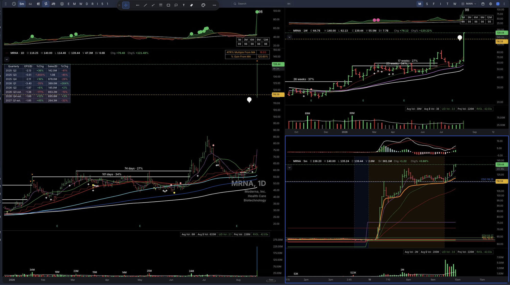
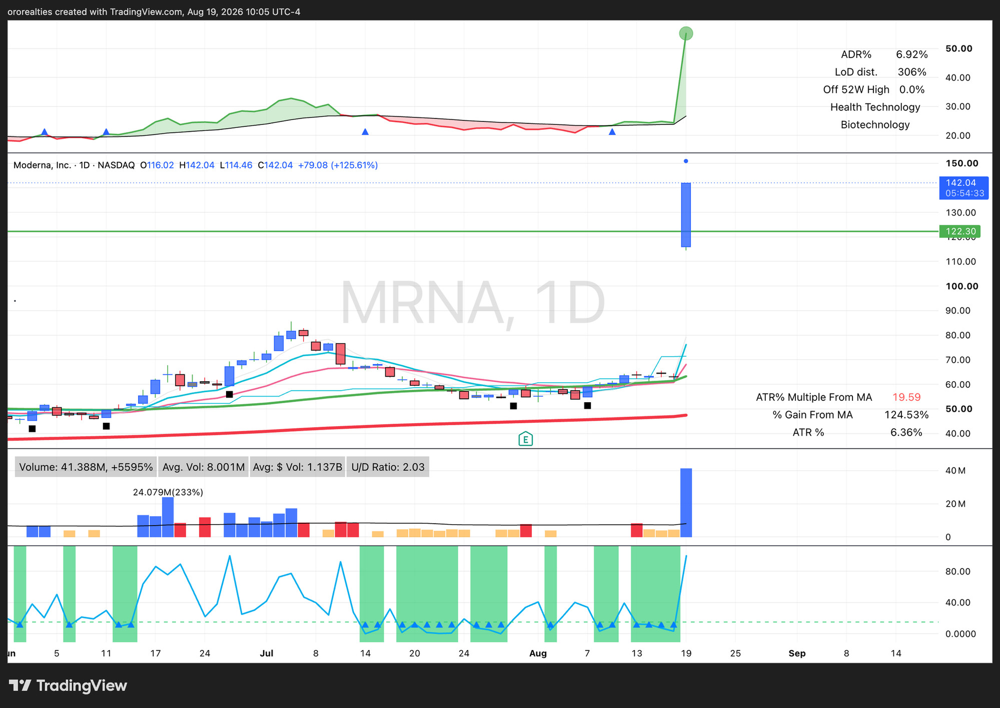

# THE REFERENCE EP — MRNA, 2026-08-19

**This is the canonical worked example of what a real EP looks like.** The operator named it
himself and asked that it be durably captured and easy to find:

> *"we caught MRNA today which is great. For future reference when we make updates, MRNA is a
> textbook EP (i also see other traders mention it as such today), the news is truly gamechanging,
> the move, etc. is textbook."*

Two independent traders called it the same thing the same morning:

> *"$MRNA MEMORIZE these daily, weekly and 5 min charts FOR EPs. THIS IS PERFECT *SO FAR*..."*
> *"For anyone wondering, $MRNA is an absolutely perfect and textbook EP. To not be confused with a PEG"*

⚠ **Why this doc exists separately from `operator_shared_notes.md`:** that file is an append-only
chronological log and this is a REFERENCE. A labelled positive is scarcer in this programme than any
negative — nearly every other worked example is a failure or a near-miss — so it needs to be
findable without scrolling a 60k-char log.

---

## 🖼 THE CHARTS

*The 4-panel he shared. Top-left daily with the quarterly EPS/sales table; bottom-left the longer
daily with the base annotations (74 days · 27%, 101 days · 34%); top-right the weekly with 17/23/26-week
bases; bottom-right the 5-minute showing the gap and the staircase along the rising short MA.*

*The TradingView daily. Carries the numbers that matter for the neglect reading: ADR% 6.92,
Off 52W High 0.0%, ATR% Multiple From MA 19.59, % Gain From MA 124.53%, volume 41.388M / +5595%
against an 8.001M average. The bottom panel's green bands mark the quiet stretches through Jul-Aug —
the neglect, visible.*

✅ **Recovered from the session transcript on 2026-08-19** — the images were stored inline as base64
and extracted rather than lost. **That is the durable path for any future shared chart**, and it
means [[capture-operator-shared-notes]] should be read as *transcribe AND extract*, not transcribe
because extraction is impossible. My first attempt claimed they could not be saved; that was wrong.

---

## 1. WHAT MAKES IT AN EP — the operator's own mechanism

### PEG vs EP — a quality line, not a pedantic one
> *"PEG is power earnings gap, a gap up after earnings. EPs are more powerful and rare."*

**The separator is the CATALYST, not the gap.** An earnings beat is scheduled and expected in kind;
an EP's catalyst is something the market had no way to price. ⚠ He did NOT say EPs exclude earnings
gaps — only that they are more powerful and rarer. The bar differs, not the source.

▶ **We already measure this line.** `expct_scheduled` (#568, live 2026-08-18) marks 8-K item 2.02 /
10-Q / 10-K as SCHEDULED — a PEG is precisely a scheduled-catalyst gap. Measured on the corpus:
**unscheduled reach ≥8×ADR 11.6% vs 3.8% scheduled.**

### 🔑 THE BIG BASE IS A PROXY FOR NEGLECT — the load-bearing insight
> *"i feel the point here is that there's a large base, so stock had time to build price structure
> and have a base to launch from if it so do so. Also, with a large base there's indication of
> neglect (at least there's no major movements up or down) so the news moving it significantly is
> truly unexpected and/or gamechanging."*

Two halves:
- **(a) A launching platform.** Time basing = price structure built = something to launch from.
  This is what the supply-ladder model (`structure_model.md`) already describes.
- **(b) NEGLECT, and this is the half that matters.** A long base with **no major move in EITHER
  direction** is evidence nobody was watching. **So when news moves it hard, the SIZE of the
  reaction proves the news was genuinely unexpected.**

**▶ THE BASE DOES NOT PREDICT THE MOVE — IT CERTIFIES THE SURPRISE.** A neglected stock that
suddenly travels ~19×ATR is, by construction, reacting to something unpriced.

**Why this unifies three findings we had been treating separately:**
| surface | how it reads "surprise" |
|---|---|
| Expectedness axis (#568) | from the CATALYST's own form — scheduled vs unscheduled |
| **The base** | **from PRICE alone, independently, with no news parsing at all** |
| RS trajectory (his 08-16: *"the tail is where i'd expect neglect to form"*) | the same idea one level up |

The weekend result that winners were **quieter and less extended** is this same thing, measured.

⚠ **MEASURE duration × QUIETNESS, not duration × depth.** I first transcribed his annotation as
tightness; he corrected it. **Absence of large UP moves counts as much as absence of down moves** —
a tight base and a neglected base are not the same object, and only the neglect reading carries a
causal story about why the reaction was large.

---

## 2. THE CHART, BY THE NUMBERS

### The base — annotated duration × depth on TWO timeframes
The author's instruction is to memorise **daily, weekly AND 5-minute together.**

| timeframe | annotated bases |
|---|---|
| **Daily** | **74 days · 27%** · **101 days · 34%** |
| **Weekly** | **17 weeks · 27%** · **23 weeks · 34%** · **26 weeks · 37%** |

A long, SHALLOW base — a quarter to a third of depth over 3–6 months. Weekly and daily agree
because they are the same base at two resolutions.

### The gap day
| metric | value |
|---|---|
| O / H / L / C | 116.02–116.25 · 140.00–142.04 · 114.46 · 139.44–142.04 |
| change | **+79.08, +125.61%** (later snapshot) · +76.48, +121.48% (earlier) |
| volume | **41.4M vs 8.0M avg — +5,595%**, RVOL **42.03×**, projected 226M |
| dollar volume | **$6.6B** on the day; avg $V 1.137B |
| **ADR%** | **6.92%** (ATR% 6.36%) |
| **ATR multiple from MA** | **18.93 → 19.59** |
| **% gain from MA** | **120.60% → 124.53%** |
| Off 52-week high | **0.0% — AT its 52-week high** |
| U/D volume ratio | 2.03–2.1 daily · 3.0 weekly |
| prior day | PDC **62.97** · PDH **64.37** → the gap roughly DOUBLED the stock |

### The 5-minute panel — the intraday half
Gap open, a brief first-bar range, then a **staircase riding a rising short moving average**, with
pullbacks holding it. Day's open marked at **CDO 116.25** and never revisited. This is the same
shape as the **620 chart** he shared 2026-08-07 (5-min, 6/20 EMA + MACD — `620_chart.md`), the
trigger we have costed but never tested (#562: a 574-ticker-day minute pull, $0).

### Fundamentals shown (quarterly EPS / sales, from the 4-panel)
Loss-making throughout — 2026 Q2 EPS −1.97 on 145.0M sales. **Worth noting explicitly: this is NOT
a fundamentals story.** The EP thesis here is catalyst + neglect + structure, not earnings quality.

---

## 3. 🔴 WHERE THIS COLLIDES WITH OUR OWN FILTERS

**1. EXTENSION — the sharpest collision.** MRNA sat **~19× ATR and +124% above its moving average**
on the day he calls perfect. `ep_detector.MAX_EXTENSION_PCT` skips when the prior close is ≥50%
above the 5-day low. It passes only because the extension was **created BY the gap** — the pre-gap
close was consolidating.
▶ **Any extension term must be measured on the PRE-GAP state. On the gap day, extension IS the
event, not a defect.**

**2. THE BASE MEASUREMENT.** Our structure work counts congestion zones CLEARED; his annotation
reads the containing base's duration and quietness. **Complementary, not equivalent** — duration ×
quietness is the candidate second axis for #569 (the structure-encoder split).

---

## 4. WHAT OUR SYSTEM ACTUALLY DID — and ranking decided it

| | ep_score | catalyst | gap | outcome |
|---|---|---|---|---|
| **MRNA** | **115.2** | strong | +33.1% | entered 09:31:09 @120.75 · **+2R partial same day, +$17.71** · 3 sh at breakeven |
| MRVL | 69.1 | strong | +11.4% | entered 09:31:01 @241.50 · **stopped same day, −$43.28 (−0.87R)** |

> *"We are near full position today and had two stocks, if we traded MRVL instead of MRNA that
> would've been a failure."*

**The book was at 5 of 5.** Both cleared the HIGH bar; only the ORDER separated a winner from a
loser. That is the opportunity-cost argument he made on 08-16 (*"funds are limited… eg 5 position
cap"*) demonstrated on one morning with two live fills — and it is why **winner DENSITY of the pool
competing for slots** is the right selection metric, not how many winners we surfaced.

⚠ **HONEST LIMITS.** One morning; both trades a day old; MRNA's 3 remaining shares unresolved;
MRVL's −0.87R is an ordinary loss, not a disaster. **The gap is the obvious confound** — 33.1% vs
11.4% — and the weekend ranking rule prefers SMALLER gaps, so **this case runs AGAINST that rule's
direction and must not be cited as support for it.**

---

## 4b. ⚠ THE CORPUS DID NOT CONFIRM EITHER TERM THIS CASE SUGGESTED (2026-08-19, same day)

Both testable terms this reference produced were built, pre-registered and measured on the
**749 tier-A gap days holding 78 tail winners** — `docs/analysis/pregap_base_axes_2026-08-19.txt`,
task #569. **Neither separates winners.**

| term | result |
|---|---|
| **pre-gap extension** | **NULL** — less vs more extended reach ≥8×ADR **11.7% vs 9.3%**, permutation p=0.55, quartiles non-monotone (Q4 highest at 13.2%) |
| **duration × quietness** | **RUNS BACKWARDS, not significantly** — long base ≥74d reaches ≥8×ADR **8.3% vs 12.0%** for shorter, p=0.36; quartiles fall monotonically 12.6% → 7.9% |

🔑 **The sharpest reading, and it reframes the extension idea specifically:** §4c's surviving
extension signal is a property of the **GAP-DAY state**. Re-anchoring it to the pre-gap close
**erases** it. "Measure extension pre-gap" sounded obviously right when derived from this chart —
the corpus says otherwise.

⚠ **Confound stated on the base term:** Spearman(base_days, ADR20) = **−0.81** — long bases are
low-ADR names. Inside ADR halves it is still null; a 6×ADR ceiling variant is null too.

**WHAT THIS DOES NOT SAY.** It does not say the neglect model is wrong. It says **these
operationalisations of it do not separate tail winners on this corpus**, at definitions written
before any outcome was looked at. Both axes now RECORD into the rank shadow, so the out-of-sample
record accrues regardless — and per the programme's standing rule, every such read is **conditional
on the current selector** and expires if selection changes.

**This is exactly why the doc says n=1.** MRNA is a reference for what he considers textbook. It is
not evidence, and the first two things it suggested did not survive contact with 749 gap days.

## 5. HOW TO USE THIS

- **A labelled positive** for what he considers textbook: game-changing news, the move, the structure.
- **A regression test for selection changes:** would this still rank MRNA above MRVL?
- **A source of two testable terms:** pre-gap extension, and duration × quietness.
- ⚠ **A reference, not evidence.** n=1. Every term it suggests must be tested on the corpus.

**Related:** `ep_profitability_program.md` §0a · `operator_shared_notes.md` 2026-08-19 ·
`620_chart.md` · `structure_model.md` · tasks #569, #562, #568.
